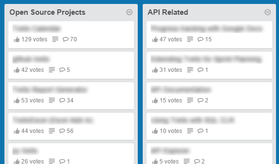

# trelloBlur

Toggleable script to blur contents of Trello cards for screenshots to show them what your board looks like. Note: It uses CSS to blur the text so exporting the data in a non-screenshot method way will contain the original underlying text.



#### Bookmarklet

Just add the bookmarklet below to your bookmarks bar.

```javascript
javascript:if($('.list-card-title').hasClass('blurTitle')){$('.list-card-title').css({"color":"black","text-shadow":"none"}).removeClass('blurTitle');}else{$('.list-card-title').css({"color":"transparent","text-shadow":"0 0 10px black"}).addClass('blurTitle');};void 0;)
```